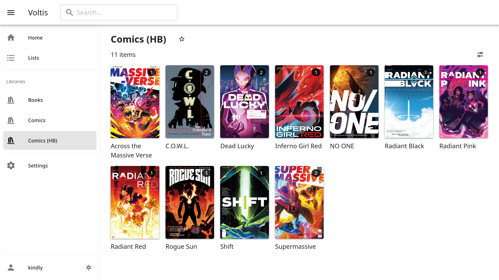

# Voltis

Voltis is a self-hosted media servers that supports comics/manga and ebooks. It
will support series, movies, and YouTube video libraries in the future as well.

**[Documentation](https://voltis.tijlvdb.me/)**

This repository is a mirror from
[git.tijlvdb.me](https://git.tijlvdb.me/tijlvdb/voltis), and does not accept
issues or pull requests at the moment.

## Roadmap

Milestones exist for the alpha and beta stages of development
[here](https://git.tijlvdb.me/tijlvdb/voltis/milestones).
